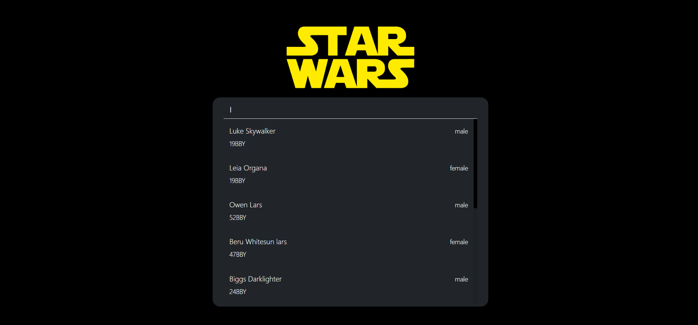
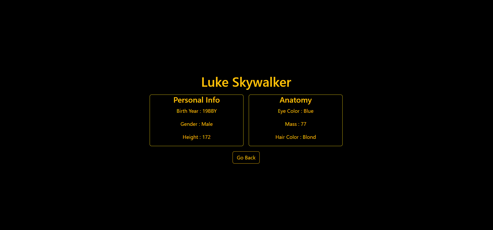

# Starwars-Character-Search-App

This is a simple web application that uses the SWAP (Star Wars API) to fetch data about Star Wars characters. With this app, users can search for a character, select a character from the search results, and view detailed information about the selected character by clicking on their name. This app also implements debouncing for improved search functionality.

## Features

- **Character Search**: Users can search for Star Wars characters by typing their names into the search bar. The search functionality is debounced to improve user experience and reduce unnecessary API requests.

- **Results Display**: The app displays a list of characters that match the search query in real-time as the user types.

- **Character Details**: Users can click on a character's name from the search results to view detailed information about that character, including their name, birth year, gender, and more.

## Debouncing

Debouncing is a critical feature of this app. It helps optimize the search process by delaying the API request until the user has finished typing their query. Here's how debouncing works in this app:

1. When the user starts typing in the search bar, a timer is set.

2. If the user continues typing, the timer is reset.

3. If the user stops typing for a predefined period (e.g., 300 milliseconds), the search query is sent to the SWAP API.

4. This delay allows the app to respond to the user's input without overloading the API with excessive requests.

## Getting Started

Follow these steps to get the SWAP API Character Search App up and running on your local machine:

1. Clone this repository to your local machine: https://github.com/Lokendra-debug/Starwars-Character-Search-App.git